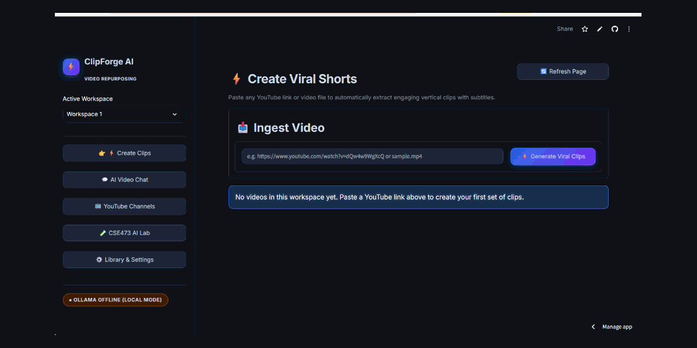
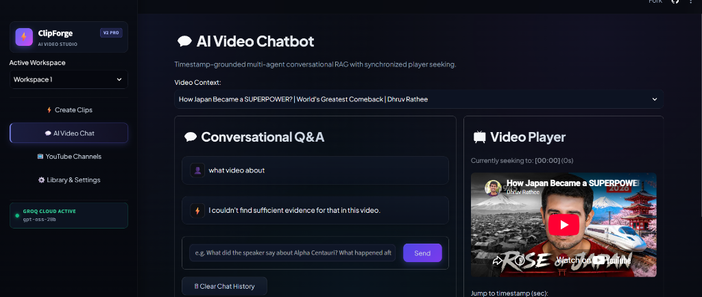
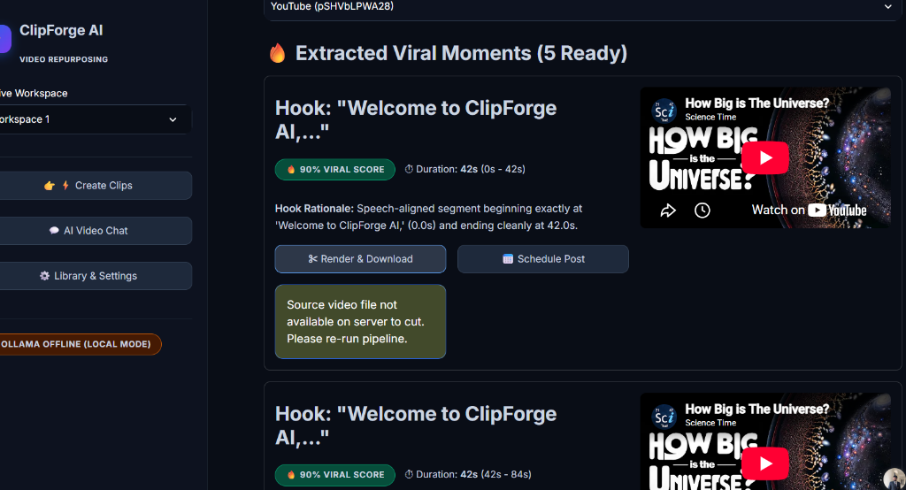
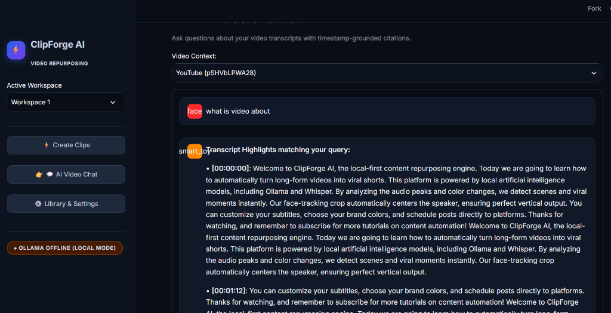
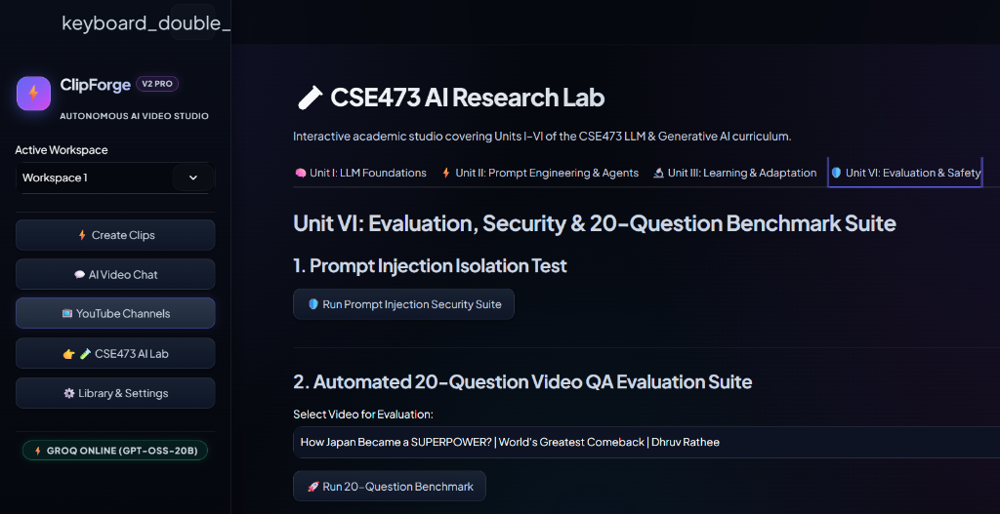
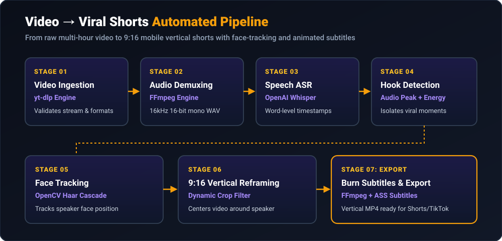
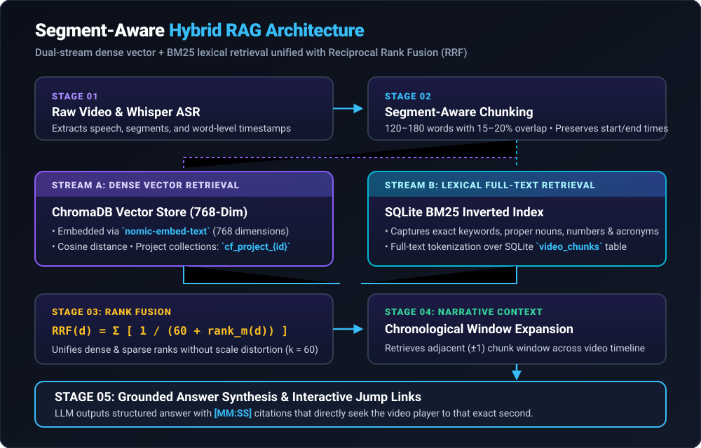
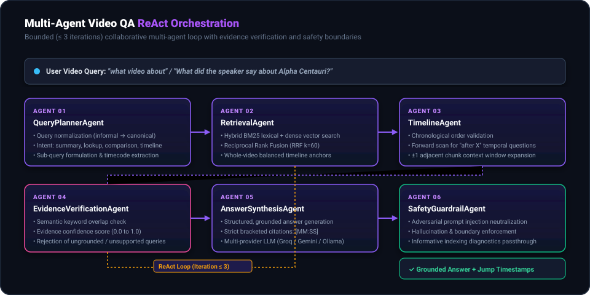
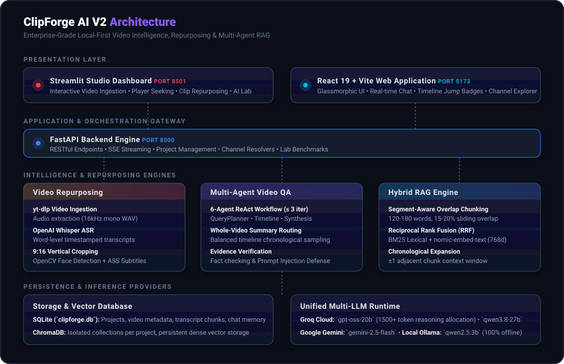
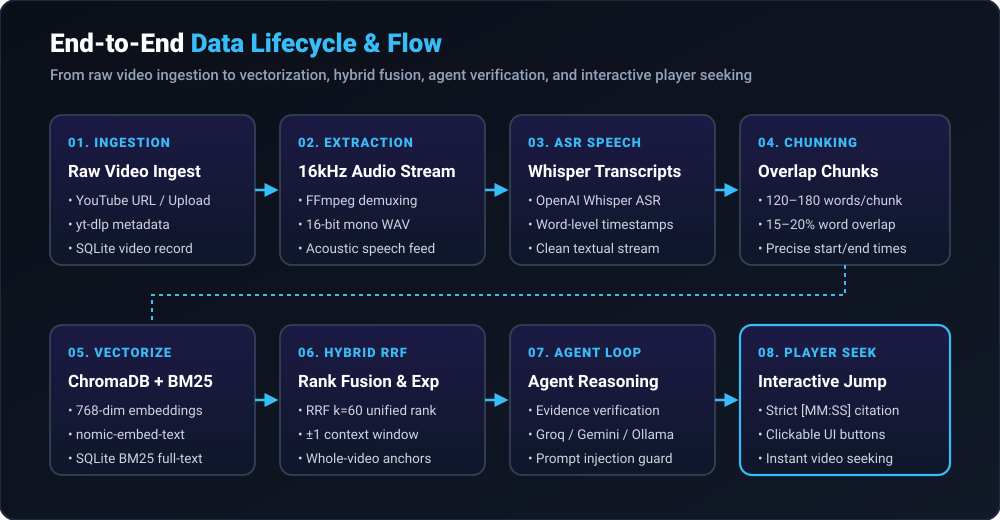

<p align="center">
  
</p>

<h3 align="center">
  Local-First AI Video Intelligence &amp; Agentic RAG Platform
</h3>

<p align="center">
  <em>Transform long-form video into viral short-form content, searchable knowledge bases, grounded answers, and deep timeline intelligence.</em>
</p>

<p align="center">
  <a href="https://clipforgee.streamlit.app"></a>
  <a href="https://github.com/ravindrareddy17/ClipForge"></a>
  <a href="docs/ARCHITECTURE.md"></a>
  <a href="docs/EVALUATION.md"></a>
</p>

<p align="center">
  
  
  
  
  
  
  
  
  
  
  
</p>

---

## 📽️ Product Overview

<p align="center">
  
</p>

---

## 📑 Table of Contents

- [What is ClipForge AI V2?](#-what-is-clipforge-ai-v2)
- [Feature Showcase](#-feature-showcase)
- [Product Showcase](#-product-showcase)
- [Video → Shorts Pipeline](#-video--shorts-pipeline)
- [Video Intelligence Engine (Hybrid RAG)](#-video-intelligence-engine-hybrid-rag)
- [Multi-Agent Video QA Engine](#-multi-agent-video-qa-engine)
- [Grounded Video QA Live Example](#-grounded-video-qa-live-example)
- [Interactive AI Engineering Lab](#-interactive-ai-engineering-lab)
- [Technical Concepts & Engineering](#-technical-concepts--engineering)
- [System Architecture](#-system-architecture)
- [End-to-End Data Flow](#-end-to-end-data-flow)
- [Supported LLM Backends](#-supported-llm-backends)
- [Repository Directory Structure](#-repository-directory-structure)
- [Prerequisites & Installation](#-prerequisites--installation)
- [Quick Start Guide](#-quick-start-guide)
- [FastAPI REST API Reference](#-fastapi-rest-api-reference)
- [Automated Testing & Verification](#-automated-testing--verification)
- [Security & Secrets Protection](#-security--secrets-protection)
- [Technical Documentation](#-technical-documentation)
- [License](#-license)
- [Project Status & Ongoing Improvements](#-project-status--ongoing-improvements)

---

## 💡 What is ClipForge AI V2?

**ClipForge AI V2** bridges the gap between raw video media and actionable intelligence. Rather than treating video as an inert binary file, ClipForge ingests hours of long-form audio/video content and converts it into a structured, searchable knowledge layer.

A single video ingested into ClipForge simultaneously produces:
1. **Vertical Repurposed Shorts (9:16)**: AI-detected high-energy hooks with facial centering and burned animated captions.
2. **Searchable Semantic Knowledge**: Overlap-aware transcript chunks vectorized into project-isolated ChromaDB collections.
3. **Conversational Video Intelligence**: A 6-agent collaborative ReAct loop that answers user queries with millisecond-exact `[MM:SS]` clickable video timestamps.

```
                      ┌───────────────────────────────────────────────┐
                      │              ONE SOURCE VIDEO                 │
                      │         (YouTube URL or Local Upload)         │
                      └───────────────────────┬───────────────────────┘
                                              │
                     ┌────────────────────────┴────────────────────────┐
                     ▼                                                 ▼
     ┌───────────────────────────────┐                 ┌───────────────────────────────┐
     │     🎬 VIDEO REPURPOSING      │                 │    🧠 VIDEO INTELLIGENCE      │
     ├───────────────────────────────┤                 ├───────────────────────────────┤
     │ • Audio energy peak detection │                 │ • Segment-aware hybrid RAG    │
     │ • Facial tracking & 9:16 crop │                 │ • Dense ChromaDB + BM25 Lex   │
     │ • Word-level ASS subtitles    │                 │ • 6-Agent ReAct reasoning     │
     │ • Viral potential ranker      │                 │ • Clickable [MM:SS] jump seek │
     └───────────────────────────────┘                 └───────────────────────────────┘
```

---

## ⚡ Feature Showcase

| 🎬 Smart Repurposing | 🧠 Video Intelligence | 🔎 Hybrid Grounded RAG |
|---|---|---|
| **AI Hook Detection**: Detects audio RMS peaks & visual scene changes to isolate compelling viral hooks. | **Whole-Video Summarization**: Balanced timeline sampling across opening, middle, and conclusion. | **Dense + Lexical RRF**: Reciprocal Rank Fusion unifies 768-dim `nomic-embed-text` with BM25 keyword precision. |
| **Speaker-Centered Crop**: OpenCV Haar Cascade centers speakers when converting 16:9 to 9:16 vertical video. | **Clickable Timestamp Seeker**: Regex-extracted `[MM:SS]` links directly jump the embedded video player. | **Context Expansion**: Automatically pulls adjacent $\pm 1$ neighbor chunks to preserve narrative flow. |

| 🤖 Multi-Agent ReAct QA | 📚 YouTube Channel Search | 🛡️ Security & Guardrails |
|---|---|---|
| **6 Specialized Agents**: QueryPlanner, Retrieval, Timeline, Verification, Synthesis, and Safety Guardrail. | **Batch Library Discovery**: Flat metadata ingestion of complete YouTube channels via `yt-dlp`. | **Adversarial Audio Defense**: Sanitizes indirect prompt injections hidden within spoken transcript audio. |
| **Informal Query Normalization**: Gracefully maps slang & incomplete inputs (e.g. *"what video about"*). | **Cross-Video Retrieval**: Queries across an entire channel catalog with `[Video Title \| MM:SS]` citations. | **API Key Masking**: Zero secrets exposed across logs, exceptions, or user interfaces (`••••••••`). |

---

## 🖥️ Product Showcase

### 1. Multi-Agent AI Video Chatbot
Ask natural-language questions about indexed videos and receive concise, grounded answers with interactive timestamp buttons that seek the video player to the exact second.

<p align="center">
  
  <br>
  <em>Figure 1: AI Video Chatbot with Groq Cloud inference, active video context, evidence-grounded Q&amp;A, and synchronized video player seeking.</em>
</p>

---

### 2. Automated Viral Short Generation
Identifies viral moments, assigns viral potential scores, provides speech-aligned hook rationales, and generates 9:16 vertical cuts ready for export.

<p align="center">
  
  <br>
  <em>Figure 2: Extracted viral moments with hook rationales, duration boundaries, viral percentage scoring, and one-click render actions.</em>
</p>

---

### 3. Transcript Grounding & Highlight Search
Search transcripts by keyword or semantic topic to inspect exact chronological time bounds and speech content.

<p align="center">
  
  <br>
  <em>Figure 3: Semantic transcript highlight matching displaying millisecond-precise time offsets and speech segments.</em>
</p>

---

### 4. Interactive AI Engineering Lab & Evaluation Suite
Visual simulator for testing transformer attention mechanisms, prompt engineering paradigms, LoRA rank decomposition, quantization trade-offs, adversarial injection neutralization, and automated 20-question QA benchmarks.

<p align="center">
  
  <br>
  <em>Figure 4: Automated 20-question evaluation benchmark runner and 4-vector prompt injection safety test suite.</em>
</p>

---

## 🎬 Video → Shorts Pipeline

ClipForge AI V2 automates the complete lifecycle from long-form video download to platform-ready vertical shorts:

<p align="center">
  
</p>

### Pipeline Execution Stages:
1. **Video Ingestion (`video_processor.py`)**: Accepts YouTube URLs or local video uploads (`.mp4`, `.mov`, `.mkv`). Validates metadata, frame rate, and dimensions.
2. **Audio Demuxing (`FFmpeg`)**: Extracts clean 16kHz mono WAV audio stream optimized for acoustic speech recognition.
3. **Speech Transcription (`whisper_transcriber.py`)**: Transcribes audio using `openai-whisper` (`base`, `small`, or `medium`), generating word-level start/end timestamps and segments.
4. **Moment Detection**: Computes rolling audio energy RMS and visual scene transitions via OpenCV to detect high-interest hooks.
5. **Face Detection & Speaker Tracking (`OpenCV`)**: Employs Haar Cascade facial detection to locate and track the primary speaker across candidate short frames.
6. **9:16 Vertical Reframing**: Crops 16:9 widescreen video into 9:16 mobile vertical aspect ratio centered dynamically on the speaker.
7. **Burned Animated Subtitles**: Compiles word-level timestamps into styled Advanced SubStation Alpha (`.ass`) subtitles and hard-subtitles the output video.

---

## 🧠 Video Intelligence Engine (Hybrid RAG)

Standard vector search fails on long-form video because broad queries (e.g., *"summarize this"*, *"what is the video about"*) lack isolated lexical keywords. ClipForge AI V2 deploys a **Segment-Aware Hybrid RAG Engine**:

<p align="center">
  
</p>

### Technical Formulation:
1. **Overlap-Aware Chunking**:
   - Chunks target **120–180 words** with a **15–20% sliding overlap**.
   - Preserves exact word-level start and end timestamps (`start_time`, `end_time`) on every chunk.
2. **Dense Vector Retrieval**:
   - Chunks are vectorized using `nomic-embed-text` into 768-dimensional float embeddings.
   - Stored in project-isolated collections within **ChromaDB** (`cf_project_{id}`).
3. **Lexical BM25 Ranking**:
   - SQLite full-text index tokenizes transcript chunks to capture exact terminology, numbers, acronyms, and proper nouns.
4. **Reciprocal Rank Fusion (RRF)**:
   - Combines dense semantic recall with lexical precision:
   $$\text{RRF}(d) = \sum_{m \in \{\text{Dense}, \text{BM25}\}} \frac{1}{k + \text{rank}_m(d)} \quad (k = 60)$$
5. **Chronological Context Expansion**:
   - High-scoring hits automatically pull their preceding and succeeding adjacent chunks ($\pm 1$), providing the LLM with surrounding context to avoid fragmented answers.
6. **Whole-Video Balanced Anchors**:
   - When whole-video summaries are requested, `tool_assemble_video_summary_context` deterministically samples the precomputed executive summary, opening thesis chunks (0:00–2:00), uniformly spaced middle anchors (25%, 50%, 75%), and concluding chunks.

---

## 🤖 Multi-Agent Video QA Engine

Video question answering is governed by a **bounded ReAct loop** ($\le 3$ iterations) coordinated across 6 specialized agent personas:

<p align="center">
  
</p>

### Agent Personas & Execution Flow:
1. **`QueryPlannerAgent`**:
   - Normalizes informal queries (`"what video about"` $\to$ `"What is this video about?"`).
   - Classifies query intent: `video_summary`, `factual_lookup`, `chronology`, `comparison`, or `timestamp_search`.
   - Extracts explicit timecodes (e.g., *"at 14:20"*) and formulates targeted search sub-queries.
2. **`RetrievalAgent`**:
   - Executes hybrid RAG (ChromaDB + BM25 + RRF) or timeline anchor assembly.
   - Enforces video isolation (guaranteeing chunks only originate from the active video).
3. **`TimelineAgent`**:
   - Validates chronological ordering and resolves relative temporal queries (*"what happened after the announcement?"*).
   - Manages $\pm 1$ neighbor chunk expansion windows.
4. **`EvidenceVerificationAgent`**:
   - Checks semantic overlap and keyword presence between question and retrieved chunks.
   - Calculates evidence confidence ($0.0 - 1.0$). If evidence is lacking, rejects the claim before hallucination can occur.
5. **`AnswerSynthesisAgent`**:
   - Synthesizes clear, objective answers citing bracketed timestamps (`[MM:SS]` or `[MM:SS–MM:SS]`).
   - Allocates a 1500+ token buffer when querying reasoning LLMs to avoid thinking-token cutoffs.
6. **`SafetyGuardrailAgent`**:
   - Sanitizes prompt injection payloads embedded in audio transcripts.
   - Enforces refusal on ungrounded out-of-domain questions while passing through clear diagnostics for unindexed videos.

---

## 💬 Grounded Video QA Live Example

Below is a live, verified execution run on the indexed video:  
**`"How Japan Became a SUPERPOWER? | World's Greatest Comeback | Dhruv Rathee"`**

<details open>
<summary><strong>Query: "what video about" (Click to expand live response)</strong></summary>
<br>

**User**:
> what video about

**ClipForge AI** *(Powered by Groq Cloud `openai/gpt-oss-20b`)*:
> **Overview**:  
> This video explores the historical transformation of Japan from a devastated nation following World War II into a global economic and technological superpower.
>
> **Main Points**:  
> 1. **The Devastation of Post-War Japan**: The video describes the catastrophic state of Japan after the atomic bombings and war, highlighting widespread destruction, starvation, and the collapse of infrastructure and society `[00:00–01:40]`.  
> 2. **The Impact of the Atomic Bombings**: It details the specific events of the bombings on Hiroshima and Nagasaki, noting the immense loss of life and the physical destruction that left the country in ruins `[01:28–03:04]`.  
> 3. **American Aid and Reconstruction**: The narrative covers how the United States provided significant financial aid, uniforms, and industrial parts to help rebuild Japan's economy and infrastructure in the immediate post-war years `[07:49–08:55]`.  
> 4. **Economic Growth and Industrialization**: The video discusses Japan's rapid industrial recovery, mentioning the rise of major corporations and the strategic use of capital to rebuild the manufacturing sector `[13:55–15:04]`.  
> 5. **The Role of Savings and Banking**: It highlights the cultural shift towards saving, explaining how people deposited money in banks and post offices, which provided the capital necessary for factories to restart and grow `[21:44–23:46]`.  
> 6. **Resilience and Hope**: The video concludes by emphasizing the Japanese people's determination to rise from the ashes, using the image of survivors striving for normal life as a symbol of hope and resilience `[26:59–27:57]`.  
>
> **Conclusion**:  
> The video concludes that Japan's greatest strength lies in its people's resilience and their ability to rise after falling, investing in education and hard work to rebuild their nation `[27:57]`.

<p align="left">
  <kbd>[00:00]</kbd> <kbd>[01:28]</kbd> <kbd>[07:49]</kbd> <kbd>[13:55]</kbd> <kbd>[21:44]</kbd> <kbd>[26:59]</kbd> <kbd>[27:57]</kbd>
  <br>
  <em>(Clicking any rendered timestamp button in the UI instantly seeks the video player to that timestamp)</em>
</p>
</details>

---

## 🧪 Interactive AI Engineering Lab

The application includes an integrated **AI Engineering Lab Studio** (`backend/clipforge_engine/cse473_lab.py`) offering interactive visual simulators and benchmarks for core AI/ML mechanics:

> [!NOTE]
> **Production vs. Experimental Separation**: The AI Engineering Lab operates as a dedicated sandboxed studio within the UI, completely isolated from the production Video Repurposing and RAG engines.

### Lab Capabilities:
- **Unit I: Transformer Fundamentals**:
  - Multi-Head Attention Heatmap Generator: $\text{Attention}(Q,K,V) = \text{softmax}\left(\frac{QK^T}{\sqrt{d_k}}\right)V$
  - BPE Subword Tokenization visualizer & compression ratio analyzer.
  - Forward-pass tensor dimension tracer ($d_{\text{model}} \to d_{\text{ff}} \to d_{\text{model}}$).
- **Unit II: Prompt Engineering & Tool Calling**:
  - 6-Paradigm Prompt Benchmark: Zero-shot, Few-shot, Chain-of-Thought, Directional, Self-Consistency, and Least-to-Most.
  - Strict JSON Tool Calling schema validator.
- **Unit III: Fine-Tuning & Reinforcement Learning**:
  - LoRA (Low-Rank Adaptation) Matrix Decomposition: $\Delta W = B \times A$ with rank $r$ parameter & memory savings calculator.
  - Multi-Precision Quantization Calculator: VRAM & memory bandwidth analysis across FP32, FP16, INT8, and INT4.
  - GridWorld Q-Learning policy convergence simulator.
- **Unit VI: Safety, Robustness & Evaluation**:
  - 4-Vector Adversarial Prompt Injection Test (Direct override, Base64 payload, Roleplay jailbreak, System prompt extraction).
  - Automated 20-Question Evaluation Battery computing accuracy, groundedness, and citation reliability.

---

## 🔬 Technical Concepts & Engineering

ClipForge AI V2 demonstrates real-world implementation of advanced engineering disciplines:

### 1. Large Language Model Engineering
- **Unified Multi-Provider Routing**: Dynamic routing across Groq Cloud, Google Gemini, Ollama, and AWS Bedrock with automatic fallback.
- **Reasoning Model Token Budgeting**: Automatically allocates a 1500+ token buffer for reasoning models (`gpt-oss-20b`, `qwen`, `deepseek`) to prevent internal thinking tokens from truncating the final response.
- **Structured Prompt Design**: Enforces bracketed timecode constraints, anti-hallucination guardrails, and markdown structures.

### 2. Retrieval-Augmented Generation (RAG)
- **Dense Vector Search**: Cosine similarity retrieval over 768-dimensional dense vectors via ChromaDB.
- **Lexical BM25 Ranking**: Inverted index full-text search over SQLite transcript chunks.
- **Reciprocal Rank Fusion**: Non-parametric rank combination eliminating score scale discrepancies.
- **Chronological Window Expansion**: Automatic $\pm 1$ neighbor expansion restoring temporal context.

### 3. Agentic AI & ReAct Loops
- **Task Decomposition & Query Planning**: Splits complex user queries into sub-queries with intent classification.
- **Tool Calling**: Tool registry exposing timeline assemblers, lexical lookups, and claim verifiers.
- **Bounded ReAct Cycles**: Hard-bounded iteration limit ($\le 3$) preventing runaway execution loops.
- **Evidence Verification**: Verifies claims against extracted transcript spans before answer synthesis.

### 4. Computer Vision & Media Engineering
- **Acoustic Audio Demuxing**: High-fidelity FFmpeg audio demuxing to 16kHz mono WAV.
- **Facial Detection**: OpenCV Haar Cascade classifiers to identify speaker faces and track coordinates frame-by-frame.
- **Dynamic Re-Framing**: Mathematically transforms 16:9 widescreen footage to 9:16 vertical shorts centered on detected speakers.
- **Advanced SubStation Alpha**: Programmatic ASS subtitle styling with word-level highlight synchronization.

### 5. Data Architecture & Isolation
- **SQLite Relational Persistence**: Complete metadata schema for projects, videos, transcript chunks, chat histories, and configurations.
- **Vector Store Isolation**: ChromaDB collections partitioned by project ID (`cf_project_{id}`), guaranteeing complete privacy between projects.
- **Stateful Memory**: Project- and video-isolated multi-turn conversational history.

---

## 🏛️ System Architecture

<p align="center">
  
</p>

### Architecture Layer Descriptions:
- **Presentation Layer**: Dual UI options—Streamlit Studio (:8501) for rich analysis and timeline video seeking, and React 19 + Vite (:5173) for a lightweight, modern web experience.
- **Application Layer**: FastAPI (:8000) REST API gateway providing SSE streaming, channel resolution, project management, and health checks.
- **Intelligence Layer**: Multi-Agent Video QA engine with ReAct loop, Hybrid RAG with RRF fusion, and the AI Engineering Lab.
- **Persistence Layer**: SQLite (`clipforge.db`) for relational metadata and ChromaDB for dense vector embeddings.
- **Compute Layer**: Local Ollama runtime for 100% offline inference alongside Groq Cloud, Google Gemini, and AWS Bedrock.

---

## 🔄 End-to-End Data Flow

<p align="center">
  
</p>

---

## 🌐 Supported LLM Backends

ClipForge AI V2 features a resilient multi-provider LLM client (`backend/clipforge_engine/llm_client.py`):

| Provider | Default Model | Fallback Models | Execution Mode | Best For |
|---|---|---|---|---|
| **Groq Cloud** | `openai/gpt-oss-20b` | `qwen/qwen3.8-27b`, `llama-3.3-70b-versatile` | Cloud (Fast) | Ultra-fast agent reasoning & synthesis (< 1.5s) |
| **Google Gemini** | `gemini-2.5-flash` | `gemini-flash-latest`, `gemini-2.5-flash-lite` | Cloud | Large-context multimodal processing |
| **Ollama (Local)** | `qwen2.5:3b` | `llama3.2:latest`, `mistral:latest` | Local (Offline) | 100% offline, privacy-first private compute |
| **AWS Bedrock** | `anthropic.claude-3-haiku` | `anthropic.claude-3-5-sonnet` | Cloud | Enterprise deployments & compliance |

---

## 📂 Repository Directory Structure

```text
ai forge/
├── app.py                             # Streamlit Studio (Video Chat, Viral Clips, Player, Lab)
├── requirements.txt                   # Unified Python dependencies
├── packages.txt                       # System binary dependencies (FFmpeg)
├── backend/
│   └── clipforge_engine/
│       ├── main.py                    # FastAPI application & REST routing
│       ├── video_qa_agents.py         # 6-Agent ReAct loop & query normalization
│       ├── rag.py                     # Hybrid RAG (BM25 + ChromaDB + RRF)
│       ├── llm_client.py              # Multi-provider client (Groq, Gemini, Ollama, Bedrock)
│       ├── channel.py                 # YouTube channel batch ingestion & search
│       ├── db.py                      # SQLite database schema, chunks, and memory
│       ├── cse473_lab.py              # AI Engineering Lab simulation modules
│       ├── video_processor.py         # Video downloading, frame extraction, 9:16 clipping
│       └── whisper_transcriber.py     # Local Whisper speech-to-text transcriber
├── frontend/                          # Modern React 19 + Vite Frontend
│   ├── src/
│   │   ├── components/                # Glassmorphic UI components, chat, timeline badges
│   │   ├── App.tsx                    # Root application component
│   │   └── main.tsx                   # Vite entry point
│   ├── package.json                   # Node.js dependencies
│   └── vite.config.ts                 # Vite bundler configuration
├── tests/
│   ├── test_clipforge_v2.py           # 20-Point Regression & Safety Test Suite
│   └── test_video_summary_intent.py   # Video summary intent & routing test battery
└── docs/                              # Technical Specifications & Documentation Assets
    ├── assets/                        # SVGs, screenshots, logos, and hero demo GIF
    ├── ARCHITECTURE.md                # System layers & data pipelines
    ├── RAG.md                         # Hybrid retrieval & RRF mathematical formulation
    ├── AGENTS.md                      # ReAct agent specifications & tool definitions
    ├── EVALUATION.md                  # Evaluation rubric & benchmark battery
    ├── SECURITY.md                    # Prompt injection & adversarial defense
    └── CSE473_RPL_MAPPING.md          # Topic-by-topic implementation mapping
```

---

## 🛠️ Prerequisites & Installation

### 1. System Requirements
- **Python**: 3.10 to 3.12
- **Node.js**: v18+ (required for React frontend)
- **FFmpeg & FFprobe**: Must be installed and present on your system `PATH`
  - *Windows*: `winget install Gyan.FFmpeg`
  - *macOS*: `brew install ffmpeg`
  - *Ubuntu/Debian*: `sudo apt-get install ffmpeg`

### 2. Setup Python Virtual Environment

```bash
# Clone the repository
git clone https://github.com/ravindrareddy17/ClipForge.git
cd ClipForge

# Create virtual environment
python -m venv .venv

# Activate virtual environment
# Windows:
.\.venv\Scripts\activate
# Linux / macOS:
source .venv/bin/activate

# Install dependencies
pip install -r requirements.txt
```

### 3. (Optional) Local Ollama Models for 100% Offline Mode

```bash
ollama pull qwen2.5:3b
ollama pull nomic-embed-text
```

---

## 🚀 Quick Start Guide

### 1. Launch Streamlit Studio (Port 8501)
The primary interface for video ingestion, timeline playback, clip creation, AI video chat, and the AI lab:

```bash
streamlit run app.py --server.port 8501
```
Open **`http://localhost:8501`** in your browser.

### 2. Launch FastAPI Backend Engine (Port 8000)
The high-performance REST API with interactive Swagger documentation:

```bash
# Windows PowerShell:
$env:PYTHONPATH='backend'; python -m uvicorn clipforge_engine.main:app --host 0.0.0.0 --port 8000 --reload

# Linux / macOS:
PYTHONPATH=backend python -m uvicorn clipforge_engine.main:app --host 0.0.0.0 --port 8000 --reload
```
Interactive API Docs available at **`http://localhost:8000/docs`**.

### 3. Launch React 19 Frontend (Port 5173)
The modern glassmorphic web application:

```bash
cd frontend
npm install
npm run dev -- --port 5173
```
Open **`http://localhost:5173`** in your browser.

---

## 📡 FastAPI REST API Reference

| Endpoint | Method | Request Payload | Description |
|---|---|---|---|
| `/api/health` | `GET` | — | Returns server status, active LLM provider, and database health. |
| `/api/chat` | `POST` | `{"query": str, "project_id": str, "video_id": str}` | Multi-agent Video QA returning grounded answer and `[MM:SS]` citations. |
| `/api/channels/resolve` | `POST` | `{"url": str}` | Extracts video catalog and metadata from a YouTube channel URL. |
| `/api/channels/import` | `POST` | `{"videos": List[str], "project_id": str}` | Batch imports channel videos into the indexing pipeline. |
| `/api/channels/search` | `POST` | `{"query": str, "project_id": str}` | Semantic search across entire channel video library. |
| `/api/cse473/attention-heatmaps` | `GET` | — | Unit I: Returns scaled dot-product self-attention matrices. |
| `/api/cse473/tokenizer-comparison` | `POST` | `{"text": str}` | Unit I: Compares BPE tokenization & compression ratios. |
| `/api/cse473/transformer-forward` | `POST` | `{"seq_len": int}` | Unit I: Full forward-pass tensor dimension tracer. |
| `/api/cse473/prompt-engineering-compare` | `POST` | `{"task": str}` | Unit II: Benchmarks 6 prompt engineering paradigms. |
| `/api/cse473/tool-calling-validate` | `POST` | `{"tool_call": dict}` | Unit II: JSON tool schema enforcement validator. |
| `/api/cse473/lora-decomposition` | `POST` | `{"rank": int}` | Unit III: Calculates LoRA rank $r$ parameter savings. |
| `/api/cse473/quantization-benchmark` | `POST` | — | Unit III: Analyzes FP32 vs FP16 vs INT8 vs INT4 trade-offs. |
| `/api/cse473/rl-gridworld-policy` | `POST` | `{"episodes": int}` | Unit III: Simulates Q-learning policy convergence. |
| `/api/cse473/prompt-injection-safety` | `POST` | `{"payload": str}` | Unit VI: Tests 4 adversarial injection attack vectors. |
| `/api/cse473/evaluation-benchmark` | `POST` | `{"video_id": str}` | Unit VI: Runs the automated 20-question evaluation battery. |

---

## 🧪 Automated Testing & Verification

ClipForge AI V2 includes rigorous automated test suites validating retrieval, agents, safety, and database consistency:

### 1. Video Summary & Intent Routing Suite
Tests informal query normalization, intent classification, whole-video sampling, and diagnostics:
```bash
python -m unittest tests/test_video_summary_intent.py -v
```
```text
test_01_query_normalization ... ok
test_02_intent_classification_variants ... ok
test_03_detailed_questions_intent_routing ... ok
test_04_whole_video_evidence_assembly ... ok
test_05_unindexed_video_diagnostic ... ok
test_06_video_summary_full_pipeline_execution ... ok
----------------------------------------------------------------------
Ran 6 tests in 2.133s - ALL PASS
```

### 2. Full System Regression & Safety Battery
20-point test battery covering ChromaDB isolation, RRF scoring, ReAct loops, prompt injections, and deep-video retrieval:
```bash
python -m unittest tests/test_clipforge_v2.py -v
```
```text
test_01_project_id_consistency ... ok
test_02_embedding_health ... ok
test_03_chunk_creation_with_overlap ... ok
test_04_idempotent_indexing ... ok
test_05_vector_retrieval ... ok
test_06_lexical_retrieval ... ok
test_07_hybrid_retrieval_rrf ... ok
test_08_timestamp_accuracy ... ok
test_09_video_isolation ... ok
test_10_conversation_memory ... ok
test_11_evidence_verification ... ok
test_12_unsupported_question_handling ... ok
test_13_prompt_injection_protection ... ok
test_14_channel_video_separation ... ok
test_15_agent_workflow ... ok
test_16_tool_selection ... ok
test_17_react_loop_limits ... ok
test_18_citation_generation ... ok
test_19_end_of_video_retrieval ... ok
test_20_beginning_vs_ending_comparison ... ok
----------------------------------------------------------------------
Ran 20 tests in 145.898s - ALL PASS (20/20)
```

---

## 🔐 Security & Secrets Protection

ClipForge AI strictly enforces security and privacy safeguards:
- **API Key Scrubbing & Masking**: All API keys (Groq, Gemini, Bedrock) are scrubbed and masked (`••••••••`) across logs, error traces, and user interfaces.
- **Hierarchical Secret Resolution**: Keys are resolved in order from:
  1. Streamlit Secrets (`st.secrets`) or `.streamlit/secrets.toml`
  2. Operating System Environment Variables (`GROQ_API_KEY`, `GEMINI_API_KEY`)
  3. Local encrypted SQLite configuration table
- **Adversarial Audio Sanitization**: Transcripts are passed through defensive safety guardrails to neutralize indirect prompt injection payloads hidden within video speech.
- **Workspace & Video Isolation**: Data is partitioned by project and video IDs, preventing cross-video chunk leakage.

---

## 📚 Technical Documentation

For in-depth architectural and mathematical specifications, refer to the `docs/` directory:
- [System Architecture Specification](docs/ARCHITECTURE.md)
- [Hybrid RAG & RRF Retrieval Engine](docs/RAG.md)
- [Multi-Agent Reasoning & Tool Registry](docs/AGENTS.md)
- [Evaluation Metrics & Benchmark Rubric](docs/EVALUATION.md)
- [Security & Prompt Injection Defense](docs/SECURITY.md)
- [CSE473 Academic Syllabus Mapping](docs/CSE473_RPL_MAPPING.md)

---

## 📄 License

This project is licensed under the **MIT License**. Developed for high-performance video intelligence, multimodal RAG research, and enterprise video repurposing.

---

## 🚧 Project Status & Ongoing Improvements

> [!NOTE]
> **Active Development & Evolution**: ClipForge AI V2 is under active, continuous development. While core functionalities—including Multi-Agent Video QA, whole-video summarization, hybrid RAG retrieval, YouTube channel ingestion, and the AI Engineering Lab Studio—are operational and rigorously tested, this project is continually evolving and still undergoing improvements.

### 🔮 Planned Enhancements & Changes Needed

1. **Multimodal Visual & OCR RAG**:
   - Integrating vision-language models (e.g., CLIP, VideoLLaMA, Qwen2-VL) to index visual frames, slides, charts, on-screen text/code, and scene transitions alongside spoken audio transcripts.

2. **Animated Subtitles & Automated B-Roll Insertion**:
   - Implementing word-by-word karaoke-style animated captions and automated semantic stock B-roll insertion for generated 9:16 vertical shorts.

3. **Asynchronous Distributed Processing**:
   - Adding background task queues (Celery / Redis / RQ) for high-throughput batch video ingestion, distributed Whisper GPU transcription, and background clip rendering.

4. **UI/UX Polish & Responsive Theming**:
   - Refining component color schemes, improving accessibility and contrast ratios, adding mobile-responsive layouts, and integrating custom waveform audio scrubbers.

5. **Direct Social Media Export**:
   - One-click publishing and scheduled export to YouTube Shorts, Instagram Reels, and TikTok via official developer APIs.

6. **Expanded Multilingual Translation & Synchronized Dubbing**:
   - Cross-lingual transcript translation and AI voice dubbing to repurpose video content across multiple languages seamlessly.

7. **Collaborative Multi-User Workspaces**:
   - Introducing team projects, role-based access control (RBAC), and shared video knowledge bases.

---
Contributions, feedback, and issue reports are welcome as we actively shape and expand ClipForge AI!
