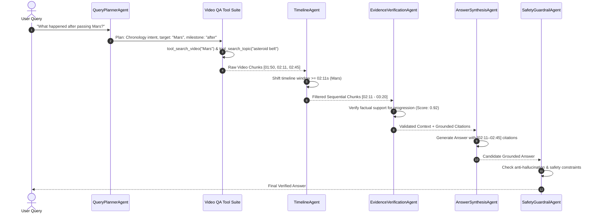

# ClipForge AI V2 — Multi-Agent Video QA Architecture & ReAct Loop

## 1. Overview & Multi-Agent Philosophy

Video Question Answering requires coordinating disparate tasks: identifying what concept the user is seeking, locating the temporal window where that concept is discussed, resolving sequential relationships (*"what happened next"*), verifying that the spoken words actually support the claim, and synthesizing an answer citing exact timestamps.

Rather than relying on a single monolithic LLM prompt, ClipForge AI V2 decomposes video QA into **6 specialized agent roles** executing within a bounded **ReAct (Reasoning + Acting)** loop.

---

## 2. The 6 Specialized Agent Roles

### Agent 1: QueryPlannerAgent
- **Responsibility**: Analyzes user question morphology, classifies intent, extracts temporal/entity markers, and generates directed sub-queries.
- **Intent Classes**:
  - `factual_lookup`: Pinpoints specific named entities or facts (*"What did the speaker say about Alpha Centauri?"*).
  - `topic_search`: Broad conceptual queries (*"What was discussed about space exploration?"*).
  - `timestamp_search`: Locates occurrences around a time mark (*"What was said at 05:08?"*).
  - `chronology`: Queries involving sequential transitions (*"What happened after passing Mars?"*).
  - `comparison`: Comparative questions spanning different segments (*"Compare the beginning and end."*).
  - `summary`: Global video overview (*"What are the main points?"*).

### Agent 2: RetrievalAgent
- **Responsibility**: Orchestrates tool selection and hybrid search over the video index.
- **Behavior**:
  - For `timestamp_search`: Invokes `tool_search_timestamp` around the target second.
  - For `comparison`: Retrieves chunks from both the initial quartile ($t < 60\text{s}$) and the terminal quartile ($t > 500\text{s}$).
  - For `summary`: Collects distributed anchors across the timeline.

### Agent 3: TimelineAgent
- **Responsibility**: Resolves sequential constraints that vector similarity alone cannot distinguish.
- **Behavior**:
  - When given an *"after X"* constraint, identifies the earliest timestamp where milestone $X$ occurs and filters/expands forward chunks chronologically.

### Agent 4: EvidenceVerificationAgent
- **Responsibility**: Validates that retrieved chunks contain substantive factual overlap with the user's query before answer generation.
- **Behavior**:
  - Extracts key query concepts and computes overlap ratio against retrieved context.
  - If concepts are missing (< 0.15 confidence) and the query is an out-of-domain distraction (*"dinosaur extinction"* in a cosmic scale video), flags `insufficient_evidence = True`.

### Agent 5: AnswerSynthesisAgent
- **Responsibility**: Generates natural, coherent responses strictly grounded in the verified context blocks.
- **Rules**:
  - Cites exact timestamps (`[MM:SS]` or `[MM:SS–MM:SS]`).
  - Formats discourse naturally without exposing agent internals.

### Agent 6: SafetyGuardrailAgent
- **Responsibility**: Final boundary enforcement, anti-hallucination check, and prompt injection neutralization.
- **Behavior**:
  - If `insufficient_evidence` was flagged, intercepts the output and returns:
    *"I couldn't find sufficient evidence for that in this video."*
  - Ensures no fabricated facts or external hallucinations are returned.

---

## 3. Explicit Tool Registry

| Tool | Parameters | Functionality |
| :--- | :--- | :--- |
| `tool_search_video` | `(project_id, video_id, query, k=5)` | Fuses BM25 lexical and ChromaDB vector search via RRF. |
| `tool_search_topic` | `(project_id, video_id, topic, k=6)` | Topic-weighted retrieval with phrase matching bonuses. |
| `tool_search_timestamp` | `(project_id, video_id, target_seconds, window=45.0)` | Retrieves chunks directly overlapping or immediately surrounding a time. |
| `tool_get_context_around_timestamp` | `(project_id, video_id, timestamp_sec, window=30.0)` | Expands contextual window around a designated second mark. |
| `tool_get_video_summary` | `(project_id, video_id)` | Returns executive summary, key topics, and timeline anchors. |
| `tool_verify_claim` | `(claim, chunks)` | Checks semantic and token overlap between claim and evidence chunks. |

---

## 4. Controlled ReAct Loop (Hard Limit: 3 Iterations)

To prevent infinite tool execution loops, ClipForge AI enforces a deterministic 3-iteration maximum:

- **Iteration 1 (Plan & Retrieve)**: Query planning identifies intent; initial hybrid search is executed.
- **Iteration 2 (Verify & Realign)**: Evidence verification inspects chunks. If sequential constraints exist, TimelineAgent realigns the window. If chunks are insufficient, fallback lexical expansions are dispatched.
- **Iteration 3 (Synthesize & Guardrail)**: Grounded answer is generated, timestamp citations validated, and guardrails enforce boundary safety.
