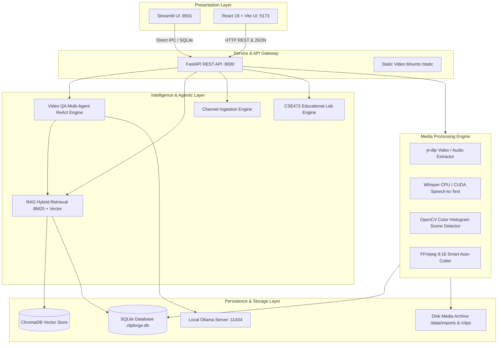

# ClipForge AI V2 — System Architecture & Component Design

## 1. Architectural Overview

ClipForge AI V2 is an enterprise-grade, local-first video intelligence and autonomous repurposing platform. It fuses **FastAPI**, **Streamlit**, **React 19 + Vite**, local **ChromaDB**, **SQLite**, and **Ollama (Qwen 2.5 3B & Nomic Embed Text)** to deliver deterministic, timestamp-grounded video intelligence, automated viral short-form clipping, and multi-agent question answering.



---

## 2. Core Subsystems & Layer Contracts

### 2.1 Presentation Layer
- **Streamlit (`app.py`)**:
  - Provides a 5-tab unified control center:
    1. `⚡ Create Viral Shorts`: Ingestion, Whisper speech-to-text, virality scoring, and 9:16 vertical slicing.
    2. `💬 AI Video Chat`: Grounded multi-agent Q&A with interactive timestamp buttons seeking the integrated video player.
    3. `📺 YouTube Channels`: Flat metadata extraction for entire YouTube channels/playlists without downloading media upfront.
    4. `🧪 CSE473 AI Lab`: Interactive studio covering Units I–VI (Tokenizer, Attention Heatmaps, LoRA, Q-Learning, Evaluation & Safety).
    5. `⚙️ Library & Settings`: Video archiving, workspace management, and local Ollama endpoint configuration.
- **React 19 + Vite (`frontend/`)**:
  - Full-featured SPA offering real-time clip editing, subtitle styling, channel ingestion modal, interactive timestamp badges that seek HTML5 video players, and high-performance SVG metrics.

### 2.2 API & Gateway Layer (`backend/clipforge_engine/main.py`)
- Provides RESTful JSON endpoints with CORS support across:
  - `/api/projects`: Multi-tenant workspace management.
  - `/api/videos`: Uploads, background processing triggers, stage tracking, and MP4 streaming.
  - `/api/clips`: Viral moment retrieval, subtitle updating, and FFmpeg burning.
  - `/api/chat`: Multi-agent ReAct question answering returning grounded text and timestamp citations.
  - `/api/channels`: YouTube channel resolving (`/resolve`), batch queuing (`/import`), and cross-channel querying (`/search`).
  - `/api/cse473`: Academic demonstration endpoints for Tokenization, Attention, LoRA, Quantization, and Security.

### 2.3 Retrieval & Multi-Agent Intelligence Layer
- **Multi-Agent Video QA (`backend/clipforge_engine/video_qa_agents.py`)**:
  - Employs 6 specialized agent personas orchestrated through a controlled 3-iteration ReAct loop:
    1. `QueryPlannerAgent`: Classifies user intent and formulates sub-queries.
    2. `RetrievalAgent`: Dispatches hybrid BM25 + Vector queries.
    3. `TimelineAgent`: Resolves sequential constraints (*"after passing Mars"*, *"beginning vs ending"*).
    4. `EvidenceVerificationAgent`: Computes factuality confidence scores and prevents hallucinations.
    5. `AnswerSynthesisAgent`: Generates structured text with mandatory `[MM:SS]` citations.
    6. `SafetyGuardrailAgent`: Intercepts unsupported queries with standardized negative evidence statements.
- **Hybrid RAG Engine (`backend/clipforge_engine/rag.py`)**:
  - Computes Reciprocal Rank Fusion (RRF) between BM25 token-weighted lexical matches and ChromaDB cosine embeddings.
  - Generates segment-aware overlapping chunks (120–180 words, 15–20% overlap) without splitting Whisper words.
  - Completely eliminates naive opening segment fallbacks.

### 2.4 Media Processing Pipeline (`backend/clipforge_engine/pipeline.py`)
- Executes 6 staged asynchronous steps:
  1. `import`: Resolves YouTube streams or validates local files; extracts duration, width, height, and FPS.
  2. `audio`: Extracts 16kHz mono WAV suitable for speech-to-text.
  3. `transcribe`: Executes local Whisper; produces word-level timestamps and segment text. Real errors fail the stage cleanly without fake mock text in production.
  4. `scenes`: Computes OpenCV color histogram correlation differences to identify visual scene cuts.
  5. `moments`: Evaluates engagement hooks using Ollama and ranks moments by virality score.
  6. `rag_index`: Creates overlapping chunks and indexes embeddings into ChromaDB and SQLite with deterministic IDs (`{video_id}_chunk_{idx}`).

---

## 3. Database Schema & Data Integrity

The SQLite database (`backend/data/clipforge.db`) maintains strict relational integrity:

```sql
-- Workspaces
CREATE TABLE IF NOT EXISTS projects (
    id TEXT PRIMARY KEY,
    name TEXT NOT NULL,
    description TEXT,
    created_at TIMESTAMP DEFAULT CURRENT_TIMESTAMP
);

-- Videos
CREATE TABLE IF NOT EXISTS videos (
    id TEXT PRIMARY KEY,
    project_id TEXT NOT NULL,
    filename TEXT NOT NULL,
    file_path TEXT NOT NULL,
    duration REAL,
    width INTEGER,
    height INTEGER,
    fps REAL,
    status TEXT DEFAULT 'pending',
    transcript TEXT,
    scenes TEXT,
    created_at TIMESTAMP DEFAULT CURRENT_TIMESTAMP,
    FOREIGN KEY(project_id) REFERENCES projects(id)
);

-- Overlapping Transcript Chunks (Grounded RAG)
CREATE TABLE IF NOT EXISTS transcript_chunks (
    id TEXT PRIMARY KEY,
    project_id TEXT NOT NULL,
    video_id TEXT NOT NULL,
    chunk_index INTEGER DEFAULT 0,
    text TEXT NOT NULL,
    start_time REAL NOT NULL,
    end_time REAL NOT NULL,
    speaker TEXT DEFAULT 'Speaker',
    topic TEXT DEFAULT '',
    embedding_model TEXT DEFAULT 'nomic-embed-text',
    embedding_dim INTEGER DEFAULT 768,
    created_at TIMESTAMP DEFAULT CURRENT_TIMESTAMP,
    FOREIGN KEY(video_id) REFERENCES videos(id),
    FOREIGN KEY(project_id) REFERENCES projects(id)
);

-- Isolated Conversation Memory
CREATE TABLE IF NOT EXISTS chat_history (
    id TEXT PRIMARY KEY,
    project_id TEXT NOT NULL,
    session_id TEXT NOT NULL,
    video_id TEXT,
    role TEXT NOT NULL,
    message TEXT NOT NULL,
    created_at TIMESTAMP DEFAULT CURRENT_TIMESTAMP,
    FOREIGN KEY(project_id) REFERENCES projects(id)
);
```

---

## 4. Concurrency & Failure Recovery
1. **Background Pipeline Isolation**: Long-running video processing runs in background worker threads without blocking FastAPI's ASGI event loop.
2. **Idempotent Upsert Semantics**: Chunks utilize deterministic composite keys (`{video_id}_chunk_{idx}`) with `INSERT OR REPLACE` semantics, preventing duplicate embeddings if a pipeline is re-run.
3. **Project ID Migration**: Built-in self-healing migrations (`migrate_project_id_consistency()`) automatically align orphaned database records to active workspace UUIDs.
